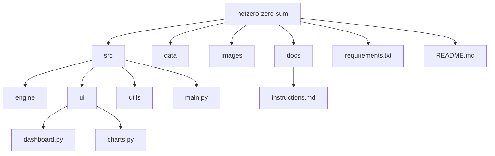

# Net Zero – Zero Sum
  
## *A Strategic Climate Simulation for Systems Thinkers*  
---

## Overview  
**Net Zero – Zero Sum** is an interactive simulation and strategy platform that challenges players, policymakers, and researchers to allocate their **\$1 trillion** budget toward accelerating the global transition to **Net Zero emissions**.  


> **Core Question:**  
> *If you had \$1 trillion to influence global climate outcomes, what would you do—and what ripple effects would follow?*  
---
What You’ll Discover

Playing Net Zero – Zero Sum isn’t just about winning—it’s about understanding your own decision-making under pressure. Every choice reveals something about your priorities, ethics, and worldview:


Your Risk Appetite
Do you go all-in on bold tech bets, or play it safe with incremental policies?


Your Strategic Lens
Are you a tech optimist, a policy pragmatist, or a cultural influencer?


Your Ethical Trade-offs
Will you prioritize short-term economic stability or long-term climate resilience?


Your Systems Thinking Skills
Can you anticipate cascading effects and unintended consequences across global networks?


Your Negotiation Style
Do you seek consensus, dominate the board, or disrupt the status quo?


Every move is a mirror—what kind of strategist will you become?

## Objectives  
- Build a **modular simulation engine** that scales from classroom use to global research.  
- Integrate **real-time OSINT and climate-economic models** for credibility.  
- Model **complex interdependencies** across:  
  - Climate systems  
  - Global economy  
  - Political stability  
  - Cultural dynamics  
  - Security risks  
- Deliver an **interactive dashboard** for scenario testing and visualization.  
- Foster **critical thinking** about climate policy, economics, and cooperation.
  

## Overview  
The game leverages **real-world datasets, OSINT sources, and dynamic modeling** to simulate **economic, political, cultural, and security feedback loops**. It’s designed as both an **educational tool** and a **policy sandbox**, enabling users to explore trade-offs, systemic risks, and unintended consequences.
  
---

## Architecture  
The system is **modular and extensible**, built in **Python** with future cloud deployment in mind.  

### **Core Modules**  
- **Economy:** GDP growth, carbon pricing, subsidies, trade elasticity  
- **Politics:** Policy adoption, treaty compliance, lobbying networks  
- **Culture:** Public opinion, activism, misinformation campaigns  
- **Security:** Resource conflicts, migration flows, cyber threats  
- **Climate:** Emissions trajectories, temperature rise, tipping points  
- **Feedback Loops:** Oscillations, cascading failures, emergent behaviors  

---

## Tech Stack  
- **Language:** Python 3.x  
- **Visualization:** Streamlit (future: React-based web UI)  
- **Data Sources:**  
  - Climate: IPCC, NOAA, NASA  
  - Economy: World Bank, IMF  
  - Politics & Security: OSINT feeds, treaty databases  

---

## Quick Start  
```bash
# Clone the repository
git clone https://github.com/your-org/netzero-zero-sum.git
cd netzero-zero-sum

# Install dependencies
pip install -r requirements.txt

# Launch the dashboard
streamlit run src/ui/dashboard.py
```

---

## How to Play  
1. Allocate your **\$1 trillion budget** using the sliders.  
2. Choose policies (Carbon Tax, Renewable Subsidies, Tech R&D).  
3. Observe the impact on emissions, GDP, and global stability.  
4. Experiment with different strategies and compare outcomes.  

### Strategy Tips  
- Diversify investments across technology and policy.  
- Watch feedback loops, aggressive carbon taxes may affect GDP.  
- Consider cultural adoption rates for renewable tech.  

---

## Project Structure  
```plaintext
netzero-zero-sum/
│
├── src/                     # Source code
│   ├── engine/              # Simulation logic
│   ├── ui/                  # Streamlit dashboard
│   │   ├── dashboard.py     # Main UI file
│   │   └── charts.py        # Chart rendering utilities
│   ├── utils/               # Helper functions
│   └── main.py              # CLI entry point
│
├── data/                    # Static datasets
├── images/                  # Logo and branding assets
├── docs/                    # Documentation
│   └── instructions.md
│
├── requirements.txt         # Python dependencies
└── README.md                # Project overview
```

---

### Visual Representation (Mermaid Diagram)  


---

## Quick Overview Table  
| Folder/File        | Description                     |
|--------------------|---------------------------------|
| src/              | Source code                    |
| ├── engine/       | Simulation logic               |
| ├── ui/           | Streamlit dashboard            |
| │   ├── dashboard.py | Main UI file               |
| │   └── charts.py    | Chart rendering utilities   |
| ├── utils/        | Helper functions               |
| └── main.py       | CLI entry point                |
| data/             | Static datasets                |
| images/           | Logo and branding assets       |
| docs/             | Documentation                  |
| └── instructions.md | Setup instructions           |
| requirements.txt  | Python dependencies            |
| README.md         | Project overview               |

Future Directions

Net Zero – Zero Sum is just the beginning. The framework is designed to evolve into a powerful platform for exploring global complexity. Here’s what’s next:


Advanced Climate Intervention Scenarios
Model geoengineering strategies, carbon removal technologies, and their ripple effects on ecosystems and economies.


Real-Time Data Integration
Connect with live OSINT feeds, climate dashboards, and economic indicators for dynamic scenario updates.


Multiplayer Negotiation Mode
Simulate international climate diplomacy with competing priorities and coalition-building mechanics.


AI-Driven Advisors
Introduce machine learning agents that challenge player strategies or suggest alternative pathways.


Expanded Infrastructure Layers
Incorporate energy grids, transportation networks, and supply chains to reflect real-world interdependencies.


Immersive Visualization
From interactive dashboards to VR-enabled global maps, make systemic risk tangible and engaging.


The goal: transform this game into a living policy sandbox for researchers, educators, and strategists worldwide.
---


## License  
MIT License © 2025 axelK-dev  
